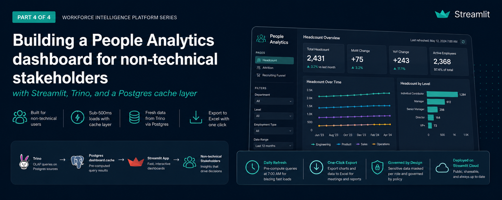
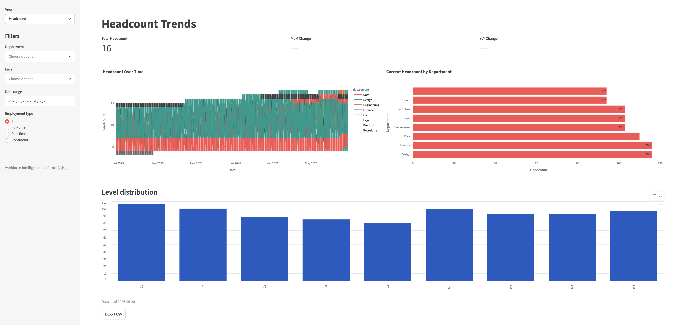
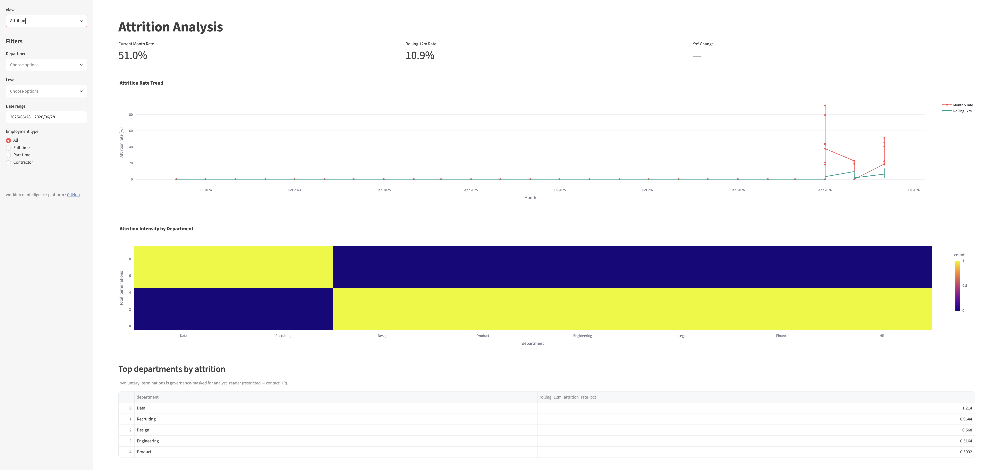
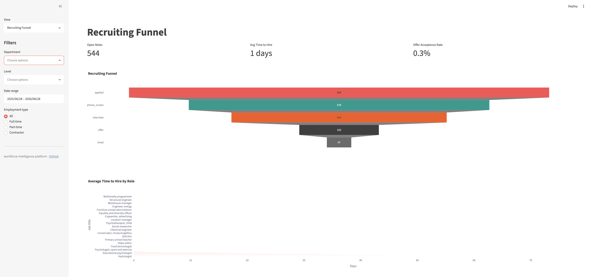

# workforce-intelligence-platform-dashboard — People Analytics Streamlit app

Part 4 of 4 in the [workforce-intelligence-platform](../README.md).

A three-page Streamlit application surfacing headcount trends, attrition analysis,
and recruiting funnel metrics for non-technical HR stakeholders.

---

## What this delivers — and why it matters

**In plain terms.** This is the part of the platform a non-engineer actually opens. The first
three modules build infrastructure — ingestion, LLM evaluation, governance — that no HR Partner
ever sees. This module turns that pipeline into a browser dashboard: pick a department, a date
range, a level, and read headcount, attrition, and recruiting answers straight off the screen.
No SQL, no data-team ticket.

**Why it matters.** Data engineering that stops at the mart layer is half a job. The tables can
be perfect, but if the only way to read them is a SQL client, the people who make headcount and
hiring decisions can't. The *last mile* — getting trustworthy numbers in front of the people who
act on them, in a form they can act on — is where a data platform either earns its keep or
quietly goes unused. This module is that last mile.

**Who uses it, and for what.**

- **HR Partners** — *"Is Engineering still growing, or did we plateau?"* Headcount trend plus
  month-over-month change, filtered to their org.
- **People Analytics / Leadership** — *"Which teams are losing people fastest?"* Monthly attrition
  rate with a rolling 12-month line that smooths single-month noise, plus a department heatmap
  that flags hot spots early.
- **Recruiters** — *"Where do candidates drop out of the funnel, and how long are roles open?"* A
  funnel chart with stage-by-stage conversion and time-to-hire by role.
- **Everyone** — an export button on every page, because the question after *"show me the number"*
  is always *"send me the data."* Self-serve here removes a recurring round-trip to the data team.

**Where it fits.** The dashboard reads the *governed* analytics layer through Trino (the OLAP read
path) rather than Postgres directly — the same pattern every analytical consumer in the platform
uses, so dashboard traffic never contends with transactional writes. The governance layer even
surfaces in the UI: restricted fields (e.g. involuntary terminations) render as
"(restricted — contact HR)" for limited roles. The result is a self-serve data product that is
fast, brand-aware, and safe to hand to non-technical stakeholders.

---

## Live demo

_Not yet deployed._ Run it locally with the steps under [Setup](#setup-local), or follow
[Streamlit Cloud deployment](#streamlit-cloud-deployment) to publish a public URL and link it here.
<!-- Replace with Streamlit Community Cloud URL after deployment -->

---

## Screenshots

A three-page app, one page per question HR teams ask most. _(Not yet deployed — captured from a local run.)_

### Headcount trends

Daily headcount over time with month-over-month change, filterable by department, level, and date range — answers *"are we still growing, or did we plateau?"*

### Attrition analysis

Monthly attrition rate with a rolling 12-month line that smooths single-month noise, plus a department heatmap that flags hot spots early.

### Recruiting funnel

Stage-by-stage conversion from application to hire, with time-to-hire by role — shows where candidates drop out and how long roles stay open.

---

## Architecture

```
  Trino (OLAP layer)
  postgresql.analytics.*
         │
         ├── fct_headcount_daily   ──►  Page 1: Headcount
         ├── fct_attrition_monthly ──►  Page 2: Attrition
         └── rpt_recruiting_funnel ──►  Page 3: Recruiting
                  │
                  ▼
        dashboard.cache (Postgres)
        pre-computed query results
                  │
                  ▼
          Streamlit app (app.py)
          Deployed: Streamlit Community Cloud
                  │
                  ▼
        Airflow DAG: dashboard_refresh (daily 7am)
```

---

## Tech stack

| Concern | Technology |
|---|---|
| Frontend | Streamlit 1.35+ |
| Charts | Plotly |
| Analytical SQL | Trino 438 (via trino Python client) |
| Cache | Postgres 16 (dashboard.cache table) |
| Orchestration | Apache Airflow 2.9.1 |
| Testing | pytest + pytest-mock |
| Deployment | Streamlit Community Cloud (free) |

---

## Setup (local)

This module reads from the shared data layer, so the infra must be up and the upstream
`analytics.*` tables must exist **before** the dashboard shows data. From the repo root:

```bash
make infra-up           # start Postgres + Trino (+ Airflow)
make ingestion-setup    # create schemas/roles, seed synthetic HR data
make ingestion-dbt      # build analytics.fct_headcount_daily / fct_attrition_monthly / rpt_recruiting_funnel
```

Then run the dashboard:

```bash
cd 4-dashboard
make install            # pip install -e ".[dev]"
make run                # launches Streamlit at http://localhost:8501
```

Connection settings come from environment variables, and their defaults
(`TRINO_HOST=localhost`, `TRINO_PORT=8080`, `POSTGRES_HOST=localhost`, …) already match the
shared `docker-compose.yml` — so **no `.env` is needed for local dev**. Export `TRINO_*` /
`POSTGRES_*` only when pointing at a non-default host (e.g. a cloud Trino for deployment).

---

## Streamlit Cloud deployment

1. Fork this repo to your GitHub account
2. Go to https://share.streamlit.io → New app
3. Repository: `exclusivearj/workforce-intelligence-platform-dashboard`
4. Branch: `main`
5. Main file path: `app.py`
6. Add secrets: `TRINO_HOST`, `TRINO_PORT`, `TRINO_USER` (point at a reachable Trino instance)
7. Deploy → copy public URL into this README

> Streamlit Cloud installs from `requirements.txt` (not `pyproject.toml`), which intentionally
> omits `apache-airflow` — only the orchestration DAG needs it, not the deployed app.

---

## Make targets

| Target | Description |
|---|---|
| `make install` | Install the package + dev tooling (`pip install -e ".[dev]"`) |
| `make run` | Start Streamlit on :8501 |
| `make test` | Run test suite with coverage (≥80%) |
| `make lint` | ruff check `src/ tests/ app.py` |
| `make clean` | Remove caches + coverage artifacts |
| `make teardown` | Stop the app, clear `dashboard.cache`, then bring the shared stack down (volumes kept) |

Run `make` (or `make help`) with no target to list these. `make teardown` is the graceful inverse
of a local run: it stops any Streamlit server, truncates the dashboard's cache table (skipped if
Postgres is already down), clears local caches, then runs the repo-root `infra-down`. Volumes are
preserved — use repo-root `make infra-reset` to also wipe them.

---

## Design decisions

**Trino not direct Postgres.** Dashboards query Trino, which is the OLAP layer. This keeps
separation between transactional writes (Postgres) and analytical reads (Trino) — the same
pattern used at production scale. It also means query optimisation happens at the Trino layer
and dashboard code never needs to tune Postgres indexes.

**Postgres cache.** Trino queries on cold start can take 2-5 seconds. The `dashboard_refresh`
Airflow DAG pre-computes the default-filter query results into `dashboard.cache` daily so a
read-through layer can serve common views in under 500ms instead of paying Trino cold-start
latency. The cache table, the `cache.py` read/write helpers, and the refresh DAG are in place
and tested; wiring the page render path to read-through the cache (currently the pages query
Trino live, which is sub-second on this dataset) is the documented next enhancement.

**Export button on every page.** HR partners, Recruiters, and Legal take data to meetings.
A CSV export that matches exactly what they see on screen eliminates the "send me the raw data"
request and reduces analytical bottlenecks.

---

## Troubleshooting

**Attrition / Recruiting pages error with `Column '…_pct' cannot be resolved` (but Headcount works).**
dbt computes rates with `round()`, which yields PostgreSQL `numeric` columns that have *no
declared precision/scale* (e.g. `attrition_rate_pct`, `rolling_12m_attrition_rate_pct`,
`application_to_hire_days_avg`, `offer_acceptance_rate_pct`). Trino's JDBC connector **silently
drops** unbounded-`numeric` columns by default, so those fields are invisible to every query —
which is why Headcount (all `date`/`text`/`bigint` columns) works while Attrition and Recruiting
fail. The fix lives in the shared Trino catalog config
(`1-ingestion/docker/trino/catalog/postgresql.properties`):

```properties
decimal-mapping=ALLOW_OVERFLOW
decimal-rounding-mode=HALF_UP
decimal-default-scale=6
```

Restart Trino after editing (`docker compose restart trino`). Verify with
`SHOW COLUMNS FROM postgresql.analytics.fct_attrition_monthly` — all 8 columns should appear,
with the rate columns typed `decimal(38,6)`.
